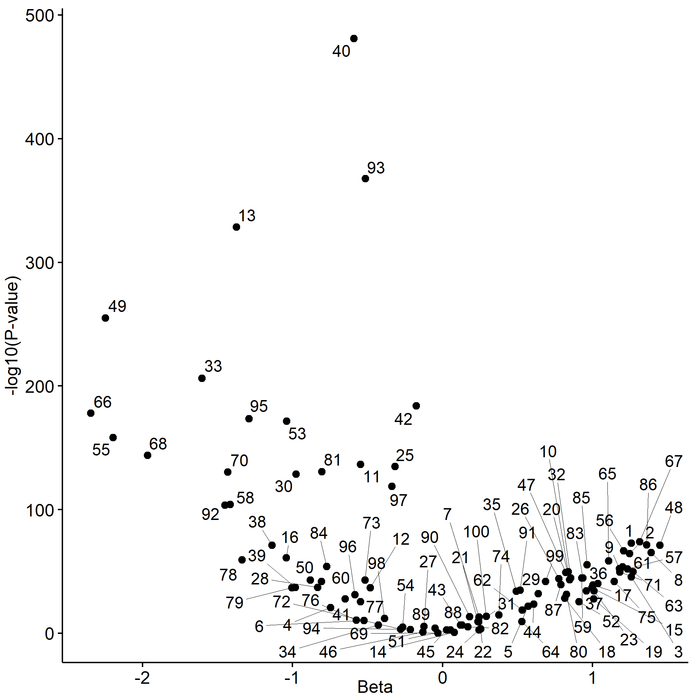

# VAE analysis using DNA methylation
This is an outline of the project using VAE to analyze BRCA DNA methylation data

## Introduction

## Methods
1. Data
1. VAE model
1. Analysis
    1. Latent dimensions
    1. Dimensionality reduction
    1. Subtype classification
1. EWAS
1. LaEWAS
1. Latent dimension correlations
1. Known DMRs and where they are in nodes
1. Genomic context
    1. Correlation of CpG with VAE dimensions
    1. GO & GSA analysis
    1. Enhancer enrichment
    1. Telomere enrichment

## Results

1. Latent dimensions
1. Dimensionality reduction
1. Subtype classification
1. 300K CpG EWAS
1. 100 node LaEWAS

1. Latent dimension correlations

1. Known DMRs and where they are in nodes
1. Genomic context
    1. Correlation of CpG with VAE dimensions
    1. GO & GSA analysis
    1. Enhancer enrichment
    1. Telomere enrichment

## Discussion
